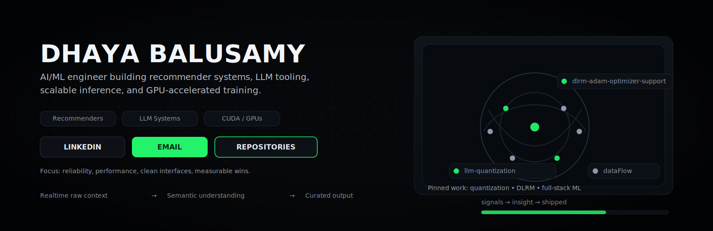

  

  
  
  

---

## About

ML Engineer and Researcher with ~5 years building and optimizing large-scale AI/ML systems.
Currently at JPMorgan Chase working on recommender systems, scalable batch/real-time inference, ML platforms, and agentic AI.
Previously collaborated with Meta on distributed training, fault-tolerant systems, and CUDA/GPU optimizations. :contentReference[oaicite:2]{index=2}

## Highlights

- Recommender systems: ranking, retrieval, offline/online evaluation, production inference
- LLM systems: quantization, benchmarking, throughput/latency tuning
- Performance engineering: CUDA/GPU-aware optimizations, distributed training reliability
- ML platforms: pipelines, observability, reproducibility, cost/perf tradeoffs

## Featured projects

- **LLM Quantization Benchmarking** — FP8/INT8/INT4 workflows + benchmarking & eval harness  
  https://github.com/dhayanesh/llm-quantization :contentReference[oaicite:3]{index=3}

- **DLRM + Adam/SparseAdam support** — improved training for large dense/sparse params  
  https://github.com/dhayanesh/dlrm-adam-optimizer-support :contentReference[oaicite:4]{index=4}

- **dataFlow** — full-stack diabetes data processing + ML pipeline  
  https://github.com/dhayanesh/dataFlow :contentReference[oaicite:5]{index=5}

## Connect

- LinkedIn: https://www.linkedin.com/in/dhayaneshwar :contentReference[oaicite:6]{index=6}
- Email: dhaya2698@gmail.com :contentReference[oaicite:7]{index=7}
